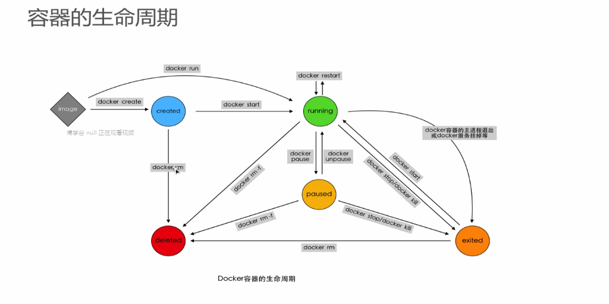

### 生命周期

### create 创建容器
docker create [OPTIONS] image [COMMAND] [ARG...] 创建
1. 输入命令
docker create centos ls -s 命令
2. 创建容器名称
docker create --name centos-test centos  
docker ps -a

3. -t 参数 分配一个伪TTY,一个终端,-i 及时没有连接也保持STDIN打开状态
docker create -ti centos python

4. 命令参数
  COMMAND 表示容器启动后,需要在容器中执行的命令,如ps.ls
  ARG 表示执行COMMOND时需要提供的一些参数,如ps命令的aux,ls -a

### rm 删除容器
docker rm [OPTIONS] CONTAINER [CONTAINER...]
docker rm id

### start 开启容器
docker start  CONTAINER
 -a: 获取输出结果
 -i: 保持连接
 -t: 终端
docker start -it centos-python

### run 创建并开启容器
docker run  [OPTIONS] CONTAINER [CONTAINER...] 
docker run -it centos python
  -d: 后台运行
  -it: 终端保持连接
docker run = docker create + docker start -a 前台模式
docker run -d = docker create + docker start 后台模式

### stop 停止容器
docker stop  [OPTIONS] CONTAINER [CONTAINER...] 
关闭要等10s
docker stop -t 2 centos 两秒停止
  -t: 停止的等待时间

### kill 杀死容器
docker kill  [OPTIONS] CONTAINER [CONTAINER...] 

### pause/unpause 暂停容器
docker pause  [OPTIONS] CONTAINER [CONTAINER...] 

### restart 重启容器 
docker restart  [OPTIONS] CONTAINER [CONTAINER...] 

### logs 容器查看日志信息
docker logs  [OPTIONS] CONTAINER [CONTAINER...]   
查看的是命令的输出内容

### rename 容器重命名
docker rename  [OPTIONS] CONTAINER [CONTAINER...]   
docker rename 43ab python

### attach 容器运行时操作
docker attach  [OPTIONS] CONTAINER [CONTAINER...]  
可以进入容器中的程序终端,绑定到pid为1 的主进程,退出时会结束容器主进程  
将当前终端STDIN,STDOUT,STDEER绑定到正在运行的容器的主进程上实现连接  
--no-stdin

### exec 容器运行时操作
docker exec  [OPTIONS] CONTAINER [CONTAINER...]  
在一个运行容器中运行一个命令,退出时不会结束容器主进程
  -d: 后台运行
  -it: 终端保持连接
  -w: 指定目录
  -e: 设置环境变量